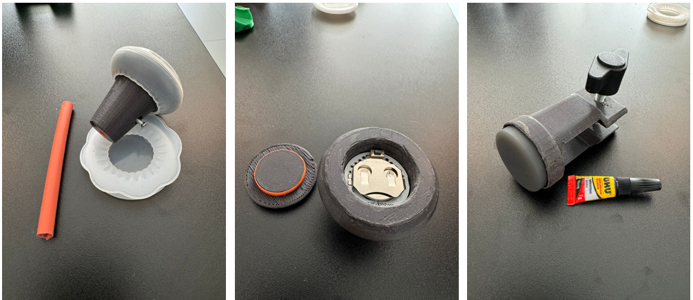

# Wheely-Joystick-Mouse

# Product Overview:
The Wheely-Joystick-Mouse is an innovative solution that transforms a wheelchair joystick into a PC mouse and includes an additional foot switch function for mouse clicks. This solution utilizes two Puck.js microcontrollers that communicate wirelessly via Bluetooth, ensuring seamless integration and easy operation.

## Key Features:

1.  Joystick Integration:
   - Functionality: The wheelchair joystick is used as a PC mouse.
   - Movement Control: Precise control of the mouse cursor through joystick movement.
   - Adjustable Sensitivity: Settings to adjust joystick sensitivity to individual needs.

2. Foot Switch for Mouse Clicks:
   - Functionality: An additional button on the leg allows for mouse clicks.
   - Easy to Use: Convenient positioning and easy operation with minimal effort.

3. Wireless Communication:
   - Bluetooth Connectivity: Both Puck.js microcontrollers communicate wirelessly via Bluetooth, ensuring a reliable and stable connection.

## Technical Specifications:
- Microcontroller: Puck.js with Bluetooth Low Energy (BLE) support.
- Power Supply: Battery-powered (CR2032 coin cell) with long battery life.
- Compatibility: Compatible with Windows, macOS, and Linux operating systems.
- Range: Up to 10 meters wireless range.

## Material:
- 2x Puck.js microcontrollers
- 1x Super Glue
- 1x Wire
- 2x 3D printed Device to mount microcontrollers to the Wheelchair
- 1x Screw
- 1x Nut

The Wheely-Joystick-Mouse is the perfect solution to enhance the accessibility and independence of wheelchair users. With easy installation and user-friendly operation, users can effectively control their computers without additional assistance.

## User Documentation:
- [WheelyJoystickMouse Präsentation](WheelyJoystickMouse.pptx)
- [User Manual](UserManual.docx)
